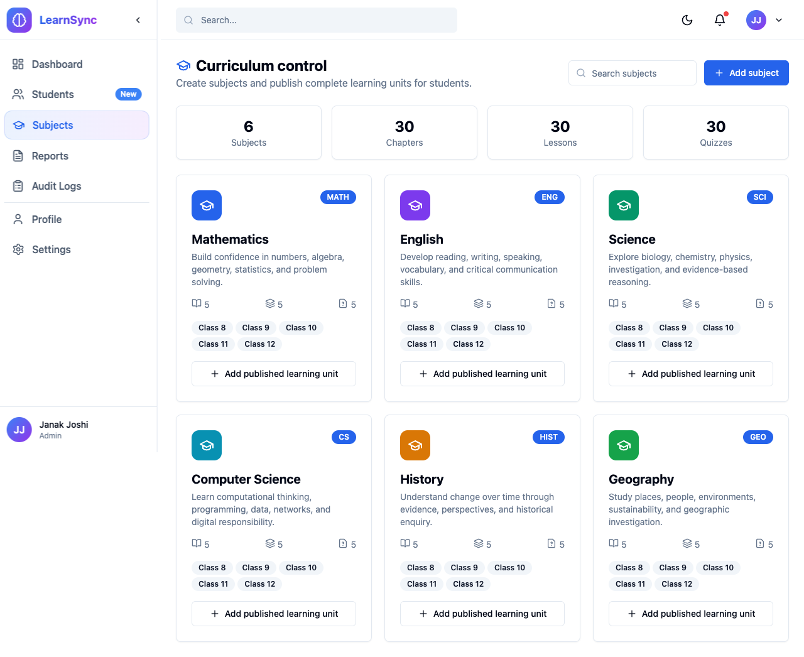
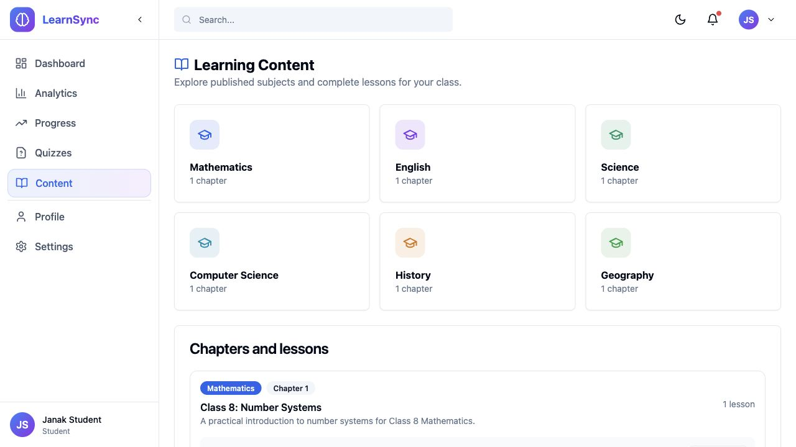
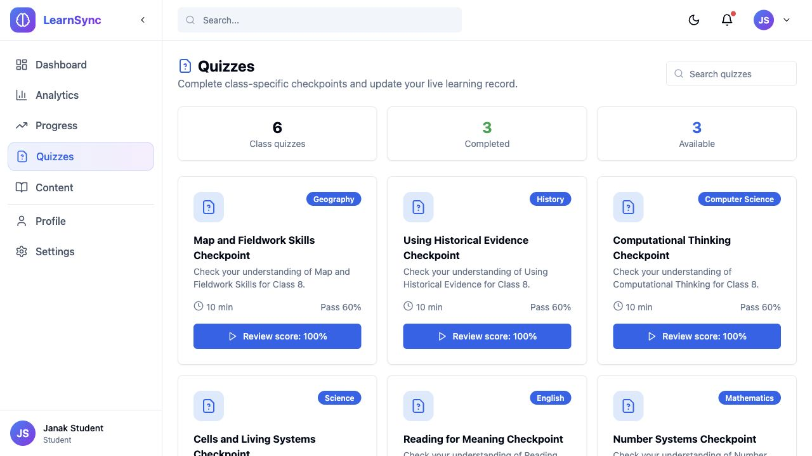
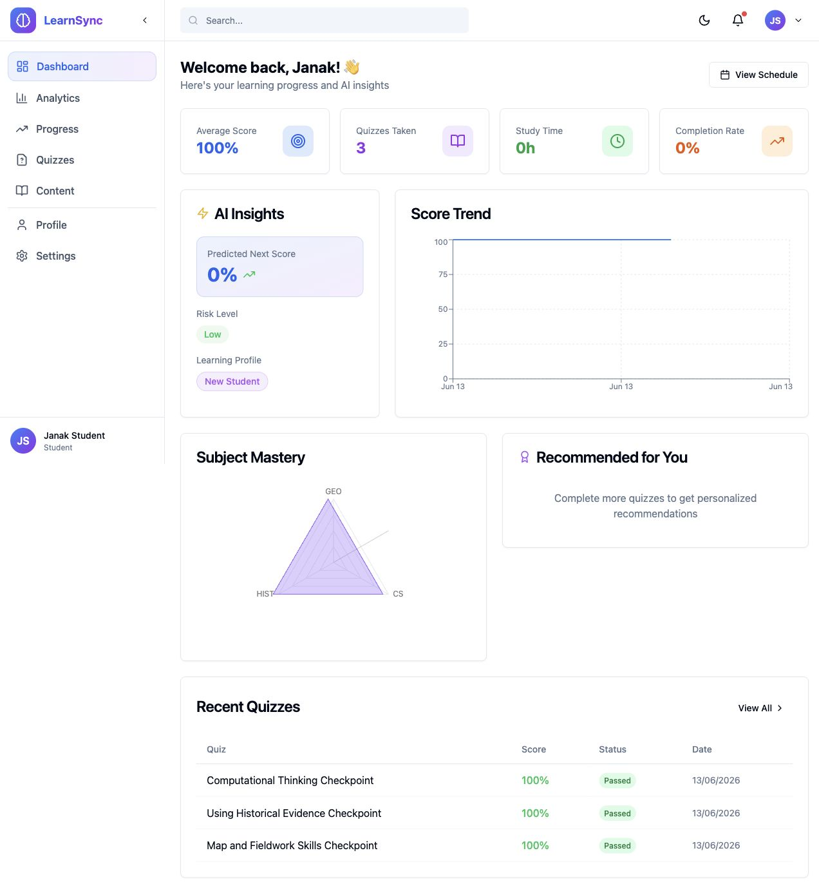

# LearnSync AI - AI-Powered Learning Analytics Platform


> **Research-Based Educational Platform** | Published IEEE Research by Janak Raj Joshi,MSc Data Science - London

## 📖 Research Reference

This platform is based on the IEEE published research:
- **Paper**: [AI-Powered Learning Analytics for Educational Enhancement](https://ieeexplore.ieee.org/abstract/document/10860096)
- **Author**: Janak Raj Joshi
- **Degree**: MSc Data Science, London

---

## 🎯 Project Overview

LearnSync AI is a comprehensive, full-stack AI-driven educational platform designed for Class 8-12 students. It integrates cutting-edge machine learning with modern web technologies to deliver personalized learning experiences.

**Live application:** [digital-identity-and-learning-analy.vercel.app](https://digital-identity-and-learning-analy.vercel.app)

### Production portals

- **Student sign in:** [digital-identity-and-learning-analy.vercel.app/login](https://digital-identity-and-learning-analy.vercel.app/login)
- **Admin sign in:** [digital-identity-and-learning-analy.vercel.app/admin/login](https://digital-identity-and-learning-analy.vercel.app/admin/login)

The portals enforce role boundaries in the API: student accounts cannot enter
the admin portal, and administrator accounts cannot enter the student portal.

### Key Features

- 🔐 **Secure Digital Identity** - JWT-based authentication with role-based access control
- 📚 **Class-Specific Curriculum** - Published subjects, chapters, lessons, and quizzes for Classes 8-12
- 🧑‍🏫 **Admin Curriculum Control** - Create subjects or publish a complete chapter, lesson, and quiz together
- ✅ **Working Learning Flows** - Students can open lessons, record completion, take quizzes, and see results
- 🤖 **AI-Powered Learning Analytics** - Real-time performance tracking and predictions
- 📊 **Intelligent Performance Tracking** - Comprehensive dashboards with visualizations
- 🎯 **Adaptive Learning Recommendations** - ML-powered personalized study plans
- 📈 **Completion Monitoring** - Track progress with detailed analytics
- 🧠 **Behavioral Insights** - Student clustering and risk assessment

---

## Production Screenshots

The screenshots below show the deployed production application connected to
MongoDB Atlas.

### Admin curriculum control

Admins can manage the shared subject catalogue, inspect live totals, and
publish new class-specific learning units.



### Student learning content

Students only receive published subjects, chapters, lessons, and quizzes
assigned to their class.



### Student quizzes and live record

Quiz submissions update the student's score history, analytics, and admin reporting data.



### Student analytics dashboard



### Verified production curriculum

| Scope | Subjects | Chapters | Modules | Quizzes |
|---|---:|---:|---:|---:|
| Platform admin catalogue | 6 | 30 | 60 | 60 |
| One student class | 6 | 6 | 12 | 12 |

Every class/subject includes a **Core Concepts** lesson and an **Applied
Practice** lesson. Each lesson has subject-specific explanations, an
independent task, and its own checkpoint quiz with feedback.

---

## 🏗️ System Architecture

```
┌─────────────────────────────────────────────────────────────────┐
│                        LearnSync AI Platform                     │
├─────────────────────────────────────────────────────────────────┤
│                                                                  │
│  ┌──────────────┐    ┌──────────────┐    ┌──────────────┐      │
│  │   Frontend   │    │    Backend   │    │  AI Service  │      │
│  │   (React)    │◄──►│   (Node.js)  │◄──►│   (Python)   │      │
│  └──────────────┘    └──────────────┘    └──────────────┘      │
│         │                   │                   │               │
│         └───────────────────┴───────────────────┘               │
│                             │                                   │
│                    ┌────────┴────────┐                          │
│                    │   MongoDB       │                          │
│                    │   (Database)    │                          │
│                    └─────────────────┘                          │
│                                                                  │
└─────────────────────────────────────────────────────────────────┘
```

### Technology Stack

| Layer | Technology |
|-------|------------|
| **Frontend** | React 18, Vite, TypeScript, Tailwind CSS, Framer Motion, Recharts |
| **Backend** | Node.js, Express.js, MongoDB, Mongoose |
| **AI Service** | Python, FastAPI, Scikit-learn, NumPy, Pandas |
| **Security** | JWT, bcrypt, Helmet, Rate Limiting |
| **Deployment** | Docker-ready, Cloud-native |

---

## 📁 Project Structure

```
learnsync-ai/
├── app/                          # Frontend Application
│   ├── src/
│   │   ├── components/           # Reusable UI components
│   │   │   └── ui/              # shadcn/ui components
│   │   ├── contexts/            # React contexts (Auth, Theme)
│   │   ├── layouts/             # Page layouts
│   │   ├── lib/                 # Utilities and API client
│   │   ├── pages/               # Application pages
│   │   │   ├── dashboard/       # Student dashboard pages
│   │   │   └── admin/           # Admin pages
│   │   └── App.tsx              # Main application
│   ├── package.json
│   └── vite.config.ts
│
├── backend/                      # Backend API
│   ├── src/
│   │   ├── controllers/         # Route controllers
│   │   ├── middleware/          # Auth, validation, error handling
│   │   ├── models/              # MongoDB models
│   │   ├── routes/              # API routes
│   │   └── utils/               # Utilities
│   ├── server.js                # Entry point
│   └── package.json
│
├── ai-service/                   # AI Microservice
│   ├── src/
│   │   └── services/            # ML services
│   │       ├── prediction_service.py
│   │       ├── clustering_service.py
│   │       ├── recommendation_service.py
│   │       └── risk_assessment_service.py
│   ├── main.py                  # FastAPI entry point
│   └── requirements.txt
│
└── README.md
```

---

## 🚀 Quick Start

### Codespaces / Docker Quick Start

Run these commands from the repository root:

```bash
bash scripts/setup-dev.sh
bash scripts/start-dev.sh
```

The start script launches MongoDB with Docker Compose, then starts the backend,
AI service, and frontend. In a new Codespace, the setup script runs
automatically. If the Codespace was created before this configuration existed,
use **Codespaces: Rebuild Container** once.

To stop MongoDB after stopping the development servers:

```bash
bash scripts/stop-dev.sh
```

### Create Development Login Accounts

Add the account emails and a password to your local `backend/.env`:

```dotenv
DEV_ADMIN_EMAIL=admin@example.com
DEV_STUDENT_EMAIL=student@example.com
DEV_ACCOUNT_PASSWORD=replace-with-a-strong-password
# Optional when admin and student should use different passwords:
DEV_ADMIN_PASSWORD=replace-with-an-admin-password
DEV_STUDENT_PASSWORD=replace-with-a-student-password
DEV_STUDENT_CLASS=8
```

The development start script creates or updates both approved accounts
automatically when these values are configured. To run the seeder separately
with MongoDB already running:

```bash
npm --prefix backend run seed:accounts
```

The command is idempotent: running it again updates the same accounts and
resets their password. With the backend running, verify both logins and their
protected dashboard APIs:

```bash
npm --prefix backend run verify:accounts
```

Never commit the real password to Git.

### Seed the Class 8-12 Curriculum

After creating the configured admin account, populate the common curriculum:

```bash
npm --prefix backend run seed:curriculum
```

The idempotent seed creates Mathematics, English, Science, Computer Science,
History, and Geography for Classes 8-12. Each class receives a published
chapter plus two readable modules and two checkpoint quizzes for every
subject. Questions and explanations are subject-specific rather than generic
placeholder content.

To prepare accounts and curriculum together:

```bash
npm --prefix backend run seed:all
```

### Production Deployment

The `app` Vercel project includes the Express backend under `/api`. Configure
these encrypted environment variables for Production and Preview deployments:

```dotenv
MONGODB_URI=mongodb+srv://...
JWT_SECRET=replace-with-a-long-random-secret
JWT_REFRESH_SECRET=replace-with-a-different-long-random-secret
DEV_ADMIN_EMAIL=admin@example.com
DEV_STUDENT_EMAIL=student@example.com
DEV_ACCOUNT_PASSWORD=replace-with-a-strong-password
DEV_STUDENT_CLASS=8
```

The API creates or updates the configured approved accounts on its first request.

After deploying, verify the production API before trying the login form:

```bash
curl https://your-domain.example/api/health
```

The response must report `"success": true` and `"database": "connected"`.

Verify both configured production accounts and their protected dashboards:

```bash
npm --prefix backend run verify:production
```

### Manual Setup

Always run these commands from the repository root. Start MongoDB first:

```bash
docker compose -f docker-compose.dev.yml up -d mongo
```

Install dependencies:

```bash
cp backend/.env.example backend/.env
npm install --prefix backend
npm ci --prefix app

python3 -m venv ai-service/.venv
ai-service/.venv/bin/python -m pip install -r ai-service/requirements.txt
```

Start each service in a separate terminal, with every terminal opened at the
repository root:

```bash
cd backend && npm run dev
```

```bash
cd ai-service && .venv/bin/python main.py
```

```bash
npm --prefix app run dev -- --host 0.0.0.0
```

### Access the Application

- Frontend: http://localhost:5173
- Student login: http://localhost:5173/login
- Admin login: http://localhost:5173/admin/login
- Backend API: http://localhost:5000
- AI Service: http://localhost:8000

In GitHub Codespaces, open the forwarded frontend port (`5173`). The frontend
uses its same-origin `/api` proxy to reach the backend, so you do not need to
open port `5000` in the browser.

---

## 👥 User Roles

### 1. Admin (Super Control Panel)

**Capabilities:**
- ✅ Approve/reject student registrations
- ✅ Assign classes (8-12)
- ✅ Create subjects and publish complete learning units
- ✅ Create chapters, readable modules, and starter quizzes together
- ✅ Upload content (PDF, video, notes)
- ✅ Create quizzes (MCQ, timed)
- ✅ Monitor completion rates and AI risk alerts
- ✅ View performance predictions
- ✅ Export analytics reports (PDF/CSV)
- ✅ Control platform settings

**Admin Dashboard Shows:**
- Total registered students
- Approved/pending students
- Active users today
- Completion percentage
- Average performance
- AI predicted performance trends
- Students at risk

### 2. Student

**Capabilities:**
- ✅ Register account (pending approval)
- ✅ Login securely
- ✅ Access assigned class content
- ✅ Open lessons and record module completion
- ✅ Take class-specific quizzes and receive immediate results
- ✅ Track completion percentage
- ✅ View quiz history
- ✅ Identify strength & weakness areas
- ✅ Get AI recommendations
- ✅ View progress timeline
- ✅ See subject mastery scores
- ✅ View skill radar charts

---

## 🤖 AI Features (Core Differentiator)

### 1. Performance Prediction Model
Predicts next quiz score based on past attempts using:
- Historical score analysis
- Trend detection
- Time-series forecasting

### 2. Weak Topic Detection
Identifies low-scoring chapters using:
- Subject-wise performance aggregation
- Statistical analysis
- Confidence scoring

### 3. Dropout Risk Analysis
Detects low engagement patterns:
- Activity frequency monitoring
- Login pattern analysis
- Quiz completion tracking

### 4. Learning Behavior Clustering
Clusters students into categories:
- **High Performer** - Consistently high scores
- **Consistent Learner** - Steady progress
- **Irregular Learner** - Inconsistent engagement
- **At Risk** - Needs intervention

### 5. Adaptive Recommendation Engine
Recommends:
- Next best module
- Revision modules
- Practice quizzes
- Suggested study hours

### 6. Completion Intelligence
Tracks:
- Time spent per module
- Learning efficiency
- Class average comparison
- Performance heatmaps

---

## 📊 Advanced Analytics Dashboard

### Visualizations Included:
- 📈 Score trend line graphs
- 📊 Subject-wise comparison bar charts
- 🔥 Chapter performance heatmaps
- 📍 Engagement vs performance scatter plots
- 🎯 Completion progress rings
- 🤖 AI insight cards

---

## 🔐 Security Features

- ✅ JWT Authentication with refresh tokens
- ✅ Role-Based Middleware
- ✅ Password Hashing (bcrypt)
- ✅ Rate Limiting
- ✅ Helmet security headers
- ✅ CORS configuration
- ✅ Input validation
- ✅ Audit logging
- ✅ Account lockout protection

---

## 🎨 UI/UX Features

- SaaS-style dashboard layout
- Responsive sidebar navigation
- Modern dark/light theme
- Glassmorphism cards
- Smooth Framer Motion animations
- Animated stats counters
- Fully responsive design
- Professional academic feel

---

## 🧪 API Documentation

### Verified workflow matrix

The following workflows are covered by automated integration tests and were
also verified against the production deployment:

- Admin and student authentication with separate role-enforced portals
- Admin dashboard, student management, live reports, and audit logs
- Admin publishing of a complete chapter, module, and quiz
- Student subject and class-content retrieval
- Lesson opening, completion, and completion-rate refresh
- Quiz start, answer submission, scoring, completion, and result review
- Student progress and analytics retrieval

Run the local regression suite:

```bash
npm test --prefix backend
npm --prefix app run lint
npm --prefix app run build
```

### Authentication Endpoints

| Method | Endpoint | Description |
|--------|----------|-------------|
| POST | `/api/auth/register` | Register new student |
| POST | `/api/auth/login` | User login |
| POST | `/api/auth/refresh` | Refresh access token |
| POST | `/api/auth/logout` | User logout |
| GET | `/api/auth/me` | Get current user |

### Admin Endpoints

| Method | Endpoint | Description |
|--------|----------|-------------|
| GET | `/api/admin/dashboard` | Admin dashboard stats |
| GET | `/api/admin/students` | List all students |
| PATCH | `/api/admin/students/:id/approve` | Approve/reject student |
| GET | `/api/admin/analytics` | Platform analytics |
| GET | `/api/admin/audit-logs` | System audit logs |

### AI Endpoints

| Method | Endpoint | Description |
|--------|----------|-------------|
| POST | `/api/ai/recommendations` | Get personalized recommendations |
| GET | `/api/ai/predict-performance` | Predict next quiz score |
| GET | `/api/ai/risk-assessment` | Get dropout risk assessment |
| GET | `/api/ai/learning-cluster` | Get learning cluster |

---

## 🌍 Scalability Considerations

Designed for:
- ✅ 10,000+ concurrent students
- ✅ Horizontal scaling with load balancers
- ✅ Microservice architecture (AI separated)
- ✅ Cloud deployment ready (AWS/GCP/Azure)
- ✅ MongoDB sharding support
- ✅ Redis caching (future enhancement)
- ✅ CDN for static assets

---

## 📝 Environment Variables

### Backend (.env)
```env
PORT=5000
NODE_ENV=development
MONGODB_URI=mongodb://localhost:27017/learnsync_ai
JWT_SECRET=your_super_secret_jwt_key
JWT_EXPIRE=7d
JWT_REFRESH_SECRET=your_refresh_token_secret
JWT_REFRESH_EXPIRE=30d
AI_SERVICE_URL=http://localhost:8000
RATE_LIMIT_WINDOW_MS=900000
RATE_LIMIT_MAX_REQUESTS=100
```

### AI Service (.env)
```env
PORT=8000
HOST=0.0.0.0
DEBUG=false
```

### Frontend (.env)
```env
VITE_API_URL=http://localhost:5000/api
```

---

## 🚢 Deployment

### Docker Deployment (Coming Soon)

```bash
# Build and run with Docker Compose
docker-compose up -d
```

### Manual Deployment

1. **Backend**: Deploy to Render, Railway, or VPS
2. **AI Service**: Deploy to PythonAnywhere, Heroku, or VPS
3. **Frontend**: Deploy to Vercel, Netlify, or AWS S3
4. **Database**: Use MongoDB Atlas for production

---

## 🤝 Contributing

1. Fork the repository
2. Create your feature branch (`git checkout -b feature/amazing-feature`)
3. Commit your changes (`git commit -m 'Add amazing feature'`)
4. Push to the branch (`git push origin feature/amazing-feature`)
5. Open a Pull Request

---

## 📄 License

This project is licensed under the MIT License - see the [LICENSE](LICENSE) file for details.

---

## 🙏 Acknowledgments

- IEEE Research Publication Support
- MSc Data Science Program, London
- Open Source Community

---

## 📧 Contact

**Janak Raj Joshi**
- Email: janak.rajjoshi@example.com
- LinkedIn: [linkedin.com/in/janakrajjoshi](https://linkedin.com/in/janakrajjoshi)
- GitHub: [github.com/janakrajjoshi](https://github.com/janakrajjoshi)

---

## 🔮 Future Enhancements

- [ ] Real-time notifications with WebSockets
- [ ] Mobile app (React Native)
- [ ] Advanced NLP for AI tutor
- [ ] Gamification features
- [ ] Parent dashboard
- [ ] Multi-language support
- [ ] Video conferencing integration
- [ ] Blockchain certificates

---

<p align="center">
  <strong>Built with ❤️ for the future of education</strong>
</p>
